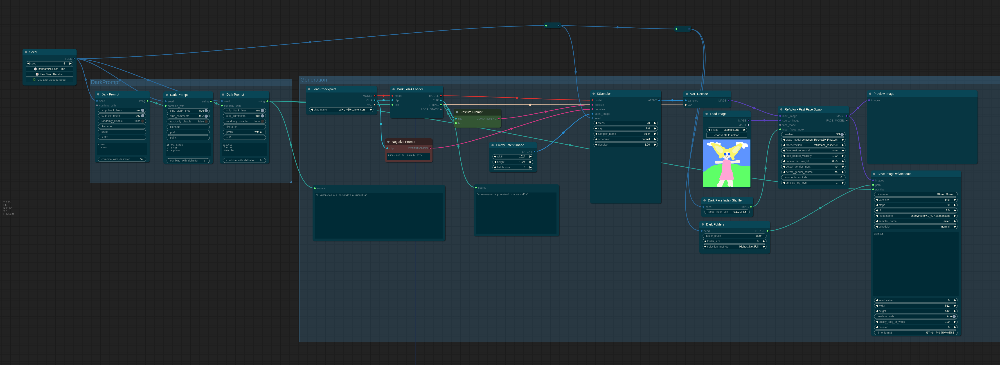

DarkPrompts
-----------

A slightly better tool for generating random prompts.

DarkPrompt
==========
DarkPrompt reads lines from a file and/or a text input, combines them together, optionally strips out comments and blank lines, and then selects a random line for use in generating your prompt based on a seed input.  It also has a "prefix" and "suffix" field so you can easily include additional information with each prompt or wrap it inside a weight.  For example a prefix of '(' and a suffix of ':1.2)' could return a string: ```(walking a dog:1.2)``` from an file named ```activities.txt``` that contains a line ```walking a dog```.

Unlike several other ComfyUI projects, the box is somewhat more compact and gives you an easy way to combine file and text sources for prompt generation.

DarkCombiner
============
DarkCombiner accepts up to 7 text inputs and combines them with an optional delimiter (\n by default) with a string output.  This allows you to easily combine multiple DarkPrompt nodes to generate complex prompts.

Screenshot
==========


Installation Using ComfyUI Manager
==================================
If you are using ComfyUI Manager, copy the URL of this repo and paste it into the "Install via Git URL" box and restart ComfyUI.

Installation into ComfyUI
=========================
Go into your custom_nodes directory and run a 'git clone https://github.com/darkpixel/darkprompts.git' and then restart ComfyUI.
